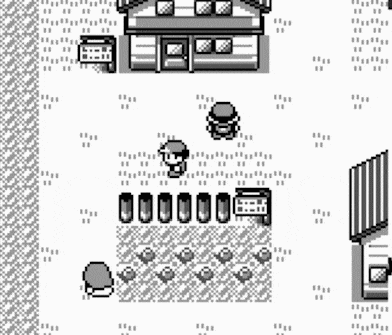

# Multimon: A Gameboy emulator for multiplayer first generation pokemon gameplay

This is a simple combination of the [PyBoy](https://github.com/Baekalfen/PyBoy) emulator with the [PodSixNet](https://pypi.org/project/PodSixNet/) networking library that allows for netplay of Pokemon Red/Blue (Red only tested). It consists of a custom emulator made with PyBoy (client.py) that tracks memory values in order to pass them to a seperate server program (server.py) that then sends state to connected players. The network code is naive in that the server does not attempt to sync state, but instead relies on both clients to be good faith actors. Current features include the ability to display both players on the map, total event and item lockout, caught pokemon lockout, and win conditions based on gym victories.  The overall idea is to create a synchronous platform on which races of a randomized first-gen runs can be played.

## Requirements
Client Side:

* Python 3.7
* PyBoy
* PodSixNet
* SDL2 DLL (in same directory as client)

Server side:

* Python 3.7
* PodSixNet

## Usage
Using this emulator requires a server clients can connect to. server.py requires two positional arguments, the first being the hostname of the server and the second the port clients will connect with. It also accepts a number of positional arguments:

* -items: Total item and event lockout. Will certainly break the game if both players start from Pallet. Binary, default false.
* -wilds: Locks out wild pokemon -- should a player catch a pokemon it will become unavailable to other players. Binary, default false.
* -position: Displays the position of other players on each player's screen. Binary, default false.
* -badge_win: Default none. Accepts badge names (In the form BoulderBadge, CascadeBadge, etc.). Should a player obtain the given badge the game will end for all players.
* -max_connections: Default 2. Max numbers of players able to connect to the server. Tested only with 2.
* -password: default none

A sample invocation looks like: "xxx.xxx.x.xx 8080 -wilds -position -badge_win CascadeBadge"

When testing locally use localhost instead of an IP address. If you wish to run a server on a VPS cloud provider (tested with [DigitalOcean](digitalocean.com)) the IP address will be the external IP of the server.

client.py also has a number of arguments. It requires positionally:

* Path to the first generation pokemon ROM to use.
* A nickname
* Hostname of the server to connect to
* Port to use when connecting

and optionally:

* -savestate: the location of a savestate to use
* -password: a server password, if required

##Issues, etc.
This was a first go for me at working with both (virtualized) gameboy hardware and netcode, as such treat it gingerly. Desyncs are absolutely possible, and there are unresolved issues with the gamestate:

* Locking out items also locks out events (such as obtaining the starter pokemon) and is thus likely to break the game.
* Wild pokemon lockout works...mostly. Due to the oddities of the first generation catch algorithm it is absolutely bypassable by the Master ball. Still, it does work:

* Numerous graphical glitches (phasing over menus etc.) with the other player on screen

Overall it "just works," and I have been able to complete CascadeBadge races against an opponent. Have fun!